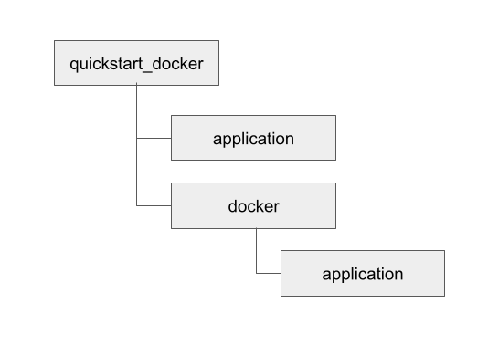

# Application's Docker image creation

While the cloud migration initiative is active at Nordlys, the developers across all teams must understand the application deployment process to a cloud infrastructure using self-created Docker images.

## Introduction

This is an instruction on deploying an application to a cloud repository using Docker to create an image of an application.

The whole procedure takes the following steps:

1) Preparing a structure of directories for the future Docker image;
2) Preparing the Dockerfile;
3) Building the Docker image.

## Prerequisites

As a prerequisite, the following conditions must be met to proceed with deploying an application to a cloud repository:

- Basic knowledge of the Terminal functionalities, such as how to navigate and create folders.
- Docker software must be installed locally on your machine. Docker is an open-source solution for applications' containerization and deployment on the cloud. For more information on the latest Docker version available on your platform, see the [Get Docker](https://docs.docker.com/get-docker/) article of the Docker Docs portal.
- You need to store your application's code as a file or set of files in an interpreted programming language. For this instruction, an example of an application is going to be written in Python:

    ```python
    import http.server
    import socketserver

    PORT = 8000

    Handler = http.server.SimpleHTTPRequestHandler

    httpd = socketserver.TCPServer(("", PORT), Handler)

    print("serving at port", PORT)
    httpd.serve_forever
    ```
  
    This simple application listens to incoming requests on port 8000 once run on a server.

## Prepare the internal structure

To comply with Docker's image-building guidelines, the application's image must consist of a set of files within a predetermined structure of directories:



- `quickstart_docker` — root directory for the image;
- `quickstart_docker/application` — directory for storing the application's code;
- `quickstart_docker/docker` — this directory contains docker-related configuration files;
- `quickstart_docker/docker/application` — this directory contains the Dockerfile environment configuration file.

To create the structure above, users can either utilize the UI instruments of their selected platform or use the terminal instead:

1) Open up a new terminal window and navigate to the directory where you will create the Docker image structure.
2) Enter the following commands to create the Docker image directory structure:

    ```bash
    mkdir quickstart_docker
    mkdir quickstart_docker/application
    mkdir quickstart_docker/docker
    mkdir quickstart_docker/docker/application
    ```

## Prepare the Dockerfile

Dockerfile is a configuration file used by the Docker software to set up the future image and its behavior upon deployment. Users can use this file to describe the dependencies to be pre-installed on the image during creation, actions to be auto-performed on the deployed container, or set up hardware configuration of the virtualized environment.

As each application requires only specific environments, users must prepare Dockerfile for their applications. For more information about the Dockerfile syntax and available commands, see the [Dockerfile reference](https://docs.docker.com/engine/reference/builder/) article of the Docker Docs portal.

For the scope of this instruction, you will create a Dockerfile for the example application shown in the Prerequisites section.

To create the Dockerfile for the example application:

1) Navigate to the future Docker image's folder `quickstart_docker/docker/application`.
2) Create a file named `Dockerfile` with the following contents:

    ```docker
    # Use base image from the registry
    FROM python:3.5

    # Set the working directory to /app
    WORKDIR /app

    # Copy the 'application' directory contents into the container at /app
    COPY ./application /app

    # Make port 8000 available to the world outside this container
    EXPOSE 8000

    # Execute 'python /app/application.py' when container launches
    CMD ["python", "/app/application.py"]
    ```

## Build the image

To build the Docker image from the created structure:

1) In a new Terminal window, navigate to the root folder of the structure and run the following command:

    ```docker
    docker build . -f-docker/application/Dockerfile -t exampleapp
    ```

    For more information about the building options, see the [docker build](https://docs.docker.com/engine/reference/commandline/build/) article of the Docker CLI Reference.
2) Check the successful image build by running the following command:

    ```docker
    docker images
    ```

    The example of the output of this command would look like this:

    ```docker
    REPOSITORY TAG IMAGE ID CREATED SIZE
    exampleapp latest 83wse0edc28a 2 seconds ago 153MB
    python 3.6 05sob8636w3f 6 weeks ago 153MB
    ```

This way, the application's image is created, and the next step is to upload it into a repository.
